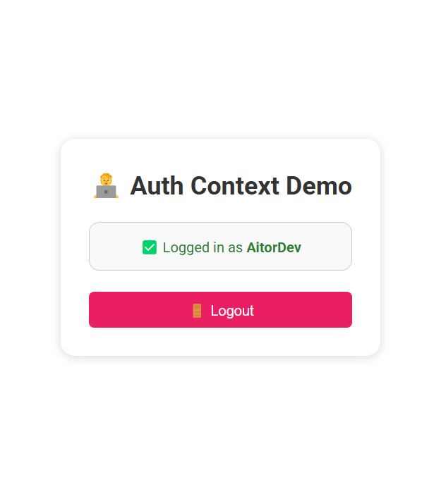
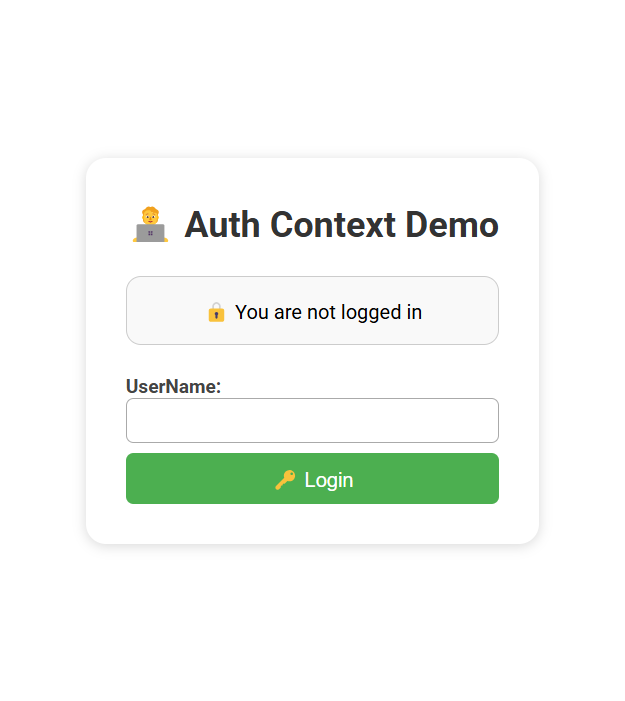

# AuthContextDemo-Context 🔐

**AuthContextDemo-Context** is a simple React project that demonstrates how to use the `useContext` hook to manage global authentication state in a React application. 👤🔄 This project focuses on providing login/logout functionality and showing how global user state can be accessed and updated from any component.

## Features ✨

- **Login & Logout**: Users can authenticate by entering a username and log out at any time. 🔑🚪
- **Global State Management**: Authentication state is managed globally using the `useContext` hook and an `authReducer`. 🧠
- **User Feedback**: The app provides dynamic feedback based on authentication status. ✅❌
- **Styled Components**: Clean and simple CSS for a user-friendly interface. 🎨

## How it works ⚙️

This project uses the `useContext` and `useReducer` hooks to manage the authentication flow across the application. Here's a brief breakdown:

1. **`AuthContext.js`**: Creates a global context for authentication. Provides `login` and `logout` functions and tracks `isAuthenticated` and `user`. 🛠️
2. **`authReducer.js`**: Handles the login and logout logic through `LOGIN` and `LOGOUT` actions. ⚖️
3. **`LoginButton.js`**: Displays an input and login button. Authenticates the user and updates global state. 🔐
4. **`LogoutButton.js`**: Shows a logout button when the user is authenticated. Triggers the `logout` function. 🚪
5. **`AuthStatus.js`**: Conditionally displays a message showing whether a user is logged in or not. 📢
6. **`App.js`**: Renders the authentication components inside the global `AuthProvider`. 🧩

  

  

