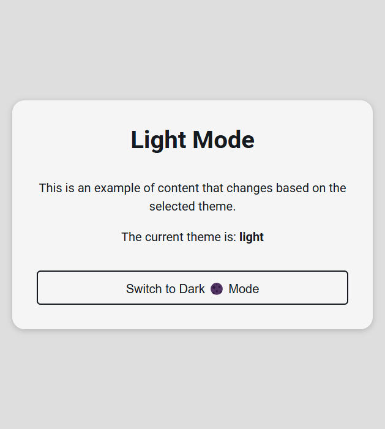
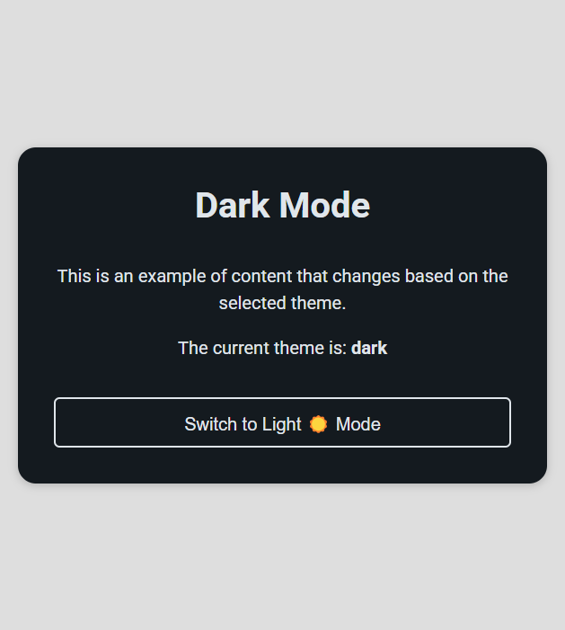

# ThemeToggle-Context 🌗

**ThemeToggle-Context** is a simple React project that demonstrates how to use the `useContext` hook to manage global state for theme toggling (light/dark mode). 🌞🌙 This project focuses on creating a flexible and reusable theme toggle feature that can easily be integrated into any React application.

## Features ✨

- **Light & Dark Mode**: The app allows users to switch between light and dark themes. 🌞🌙
- **Global State Management**: The theme state is managed globally using the `useContext` hook and a `themeReducer`. 🔄
- **Styled Components**: The application uses a simple yet elegant CSS structure to change the theme dynamically based on user interaction. 🎨

## How it works ⚙️

The app leverages the `useContext` and `useReducer` hooks to manage the theme state across the application. Here's a brief overview of how it functions:

1. **`ThemeContext.js`**: Provides the context for the theme state (`light` or `dark`) and a function (`toggleTheme`) to switch between the two themes. 🌗
2. **`ThemeToggleButton.js`**: A button component that triggers the theme change. When clicked, it switches between light and dark modes by calling the `toggleTheme` function from the context. 🔲🔘
3. **`ThemedContent.js`**: Displays content that changes based on the selected theme. The content dynamically updates to reflect the current theme (light or dark). 🖥️🌙
4. **`App.js`**: The main component that includes all the other components and applies the global `ThemeContext` to the application. 🏗️

  

  

